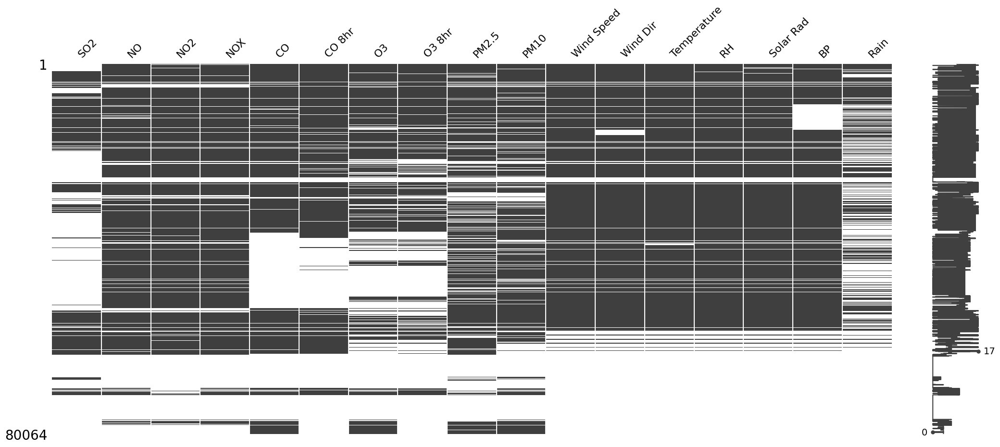
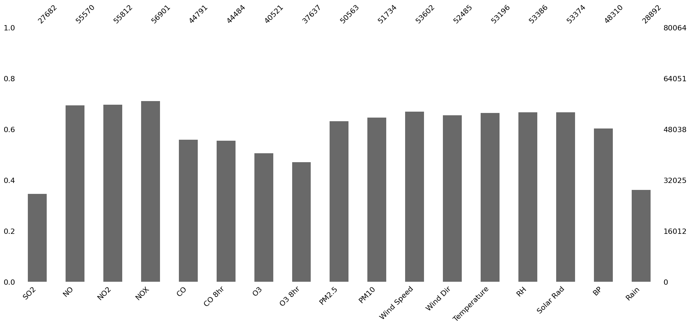
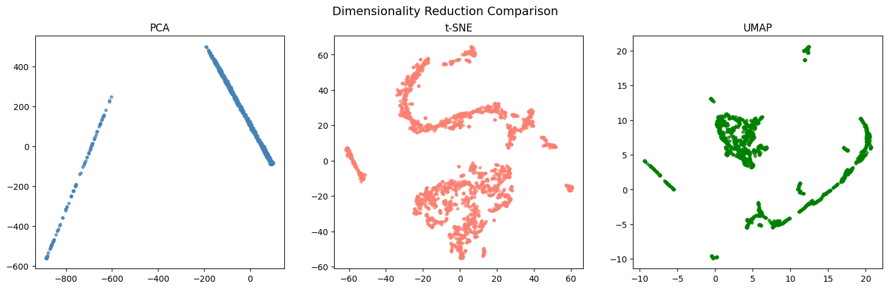
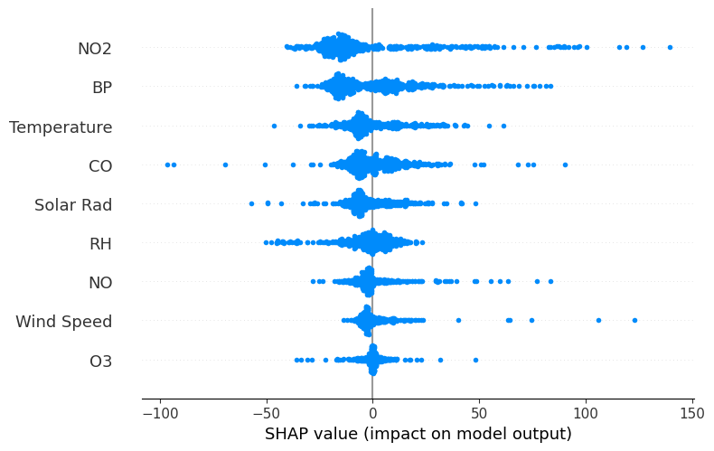
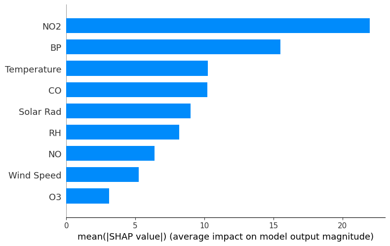

<h1>Air Quality Imputation & Exploratory Analysis — Sylhet, Bangladesh</h1>
<h2>Overview</h2>
This project explores, cleans, and analyzes air quality data from Sylhet, Bangladesh, using machine learning and visualization techniques to understand pollution trends and predict missing PM10 levels.

<h2>Objective</h2>
This project uses the Kaggle *Air Quality Index of Bangladesh* dataset (Sylhet subset) to:
<ul>
  <li>Analyze missingness patterns</li>
  <li>Clean and preprocess the data</li>
  <li>Impute missing PM10 values using a Random Forest regressor</li>
  <li>Visualize pollutant and meteorological relationships using PCA, t-SNE and UMAP</li>
  <li>Interpret model behavior using SHAP to uncover key factors affecting air quality</li>
  <li>Understand seasonal and feature-based pollution patterns for Sylhet</li>
</ul>

<h2>Contents</h2>
├── README.md 
├── Datasets/ 
│ ├── air_quality_Sylhet_dataset.xlsx 
│ └── cleaned_air_quality.csv 
├── results/ 
│ ├── [images of patterns and plots] 
├── AQI_Sylhet.ipynb

<h2>Tech Stack</h2>
<ul>
  <li><b>Data Processing</b> - Pandas, Numpy</li>
  <li><b>Visualization</b> - Matplotlib, Seaborn, Missingno</li>
  <li><b>Machine Learning</b> - Scikit-learn (RandomForest, PCA, t-SNE, UMAP)</li>
  <li><b>Explainability</b> - SHAP</li>
  <li><b>Environment</b> - Google Colab</li>
</ul>

<h2>Dataset</h2>
<b>Source</b>: <a href="https://www.kaggle.com/datasets/tahmidmir/air-quality-index-of-bangladesh-dataset">Kaggle – Air Quality Index of Bangladesh</a> 
<b>City</b>: Sylhet 
<b>Samples</b>: ~80,000 
<b>Features</b>: NO, NO₂, CO, O₃, SO₂, Temperature, Wind Speed, etc. 
<b>Target</b>: PM10

<h2>Key Steps & Highlights</h2>
<b>Data Cleaning and Imputation</b> 
<ul>
  <li>Combined Date and Time into a single datetime feature</li>
  <li>Visualized missingness with Missingno (matrix, heatmap, dendrogram, bar)</li>
  <li>Used forward-fill and Random Forest regression to estimate missing PM10 values</li>
</ul>
<b>Exploratory Analysis</b> 
<ul>
  <li>Explored air quality trends by month</li>
  <li>Correlation heatmap showed PM10 strongly related to NO₂, CO, Wind Speed, Wind Dir, and RH</li>
  <li>Identified high-pollution months through temporal grouping</li>
</ul>
<b>Dimensionality Reduction & Visualization</b> 
<ul>
  <li>Compared PCA, t-SNE, and UMAP projections to reveal hidden data structures</li>
  <li>Observed clustering patterns corresponding to pollution intensity and meteorological conditions</li>
</ul>
<b>Explainability (SHAP)</b> 
<ul>
  <li>Interpreted Random Forest predictions using SHAP</li>
  <li>Found key drivers of PM10: CO, NO₂, BP, and Temperature</li>
  <li>Visualized feature impact on model output</li>
</ul>

<h2>Visuals</h2>
<b>Missing Data Visualization</b> 
Missingno matrix shows stripes for each row and column; gaps indicate missing values 

 
Missingno bar shows the count of non-missing values per column 

 

<b>Dimensionality Reduction Comparison (PCA, t-SNE, UMAP)</b> 

 

<b>SHAP Summary Plot</b> 

  

<h2>Learnings</h2>
<ul>
  <li>Learned practical data cleaning for incomplete datasets</li>
  <li>Understood how dimensionality reduction techniques reveal different data patterns</li>
  <li>Applied SHAP to interpret Random Forest results and identify pollutant impact</li>
  <li>Strengthened understanding of environmental data analysis workflows</li>
</ul>

<h2>Future Work</h2>
<ul>
  <li>Compare air quality trends between Sylhet and Dhaka</li>
  <li>Build a forecasting model (LSTM) for PM10 prediction</li>
  <li>Deploy an interactive dashboard using Streamlit or FastAPI</li>
  <li>Integrate live data from AQI sensors or APIs</li>
</ul>

<h2>Acknowledgments</h2>
<ul>
  <li>Dataset: Kaggle – Air Quality Index of Bangladesh</li>
  <li>Libraries: Scikit-learn, SHAP, Missingno, UMAP</li>
</ul>

